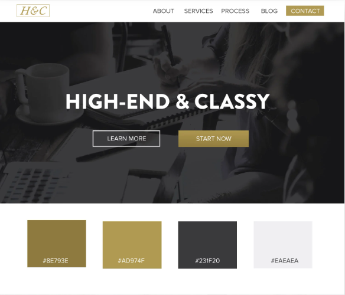

# Project Discription

* Blue Pulse is a band that creates soulful music that touches the heart and soul of its listeners. The official website of the band offers a range of features that cater to the needs of its fans and potential new listeners. 

* The website has a menu with different sections, including Home, Bio, Music, Store, Blog, and Contact. 

* The Home section is the landing page of the website, where you can find a brief introduction to the band and their latest news. 

* The Bio section provides a detailed history of the band, their members, and their musical influences. 

* The Music section contains our latest tracks and links to our music on various platforms, making it easy for fans to access their music. 

* In the Store section, fans can buy their merchandise, including t-shirts, posters, and CDs, to show their support for the band. 

* The Blog section is where the band shares their thoughts on music, life, and everything in between, providing a glimpse into their personal lives and creative process. 

* Finally, in the Contact section, fans can send them a message, book them for a gig, or just say hello, making it easy for fans to connect with the band. 

* The website is designed to provide a comprehensive overview of the band and their music to their fans and potential new listeners, making it easy for them to stay up-to-date with the band's latest news and events.

# Design (Please note this is a MVP and color and framing may change during the project)

### Landing Page

### Bio Page

### Music Page

### COLOR Pallet

.dark-gold {color: #8E793E}

.light-gold {color: #AD974F}

.intellectual-grey {color: #231F20}

.light-grey {color: #EAEAEA}